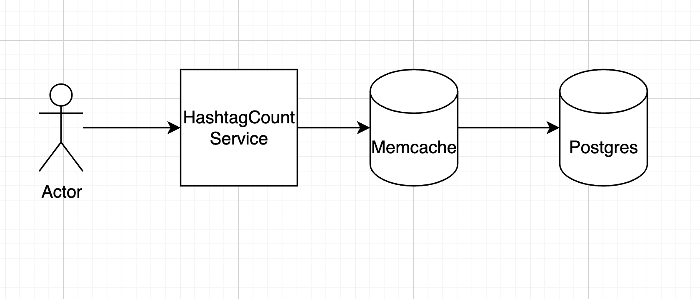

# Hashtag Search

## Overview

Hashtag Search is a web-based application that allows users to search for hashtags and view the count of their usage. The application is built using Django, a Python-based web framework, and PostgreSQL as the database.

### Getting Started
These instructions will get you a copy of the project up and running on your local machine for development and testing purposes.

### Prerequisites
- Python 3.6
- Django 3.2
- PostgreSQL 13+

### Installation

1. Clone the repository:
```
https://github.com/shaishavgupta/prodigal
```

2. Install the required packages:
```
pip install -r requirements.txt
```

3. Create a PostgreSQL database according to .env.example.

4. Start the Django development server:
```
python manage.py runserver
```

## Usage
1. Create new post with hashtags
```
curl --location 'http://localhost:8000/hashtag/' \
--header 'Content-Type: application/json' \
--data '{
    "post": "#hashtag1 #hash_tag2 ##hashtag3 not a hashtag"
}'
```

2. Get Hashtag count with exact match
```
curl --location 'http://localhost:8000/hashtag/hashtag1'
```
3. Search Hashtag count on partial index
```
curl --location 'http://localhost:8000/hashtag/search/?tag=hashtag1'
```

## Assumptions
1. Hashtags with high count will be seached frequently and with low count wont be as frequent.
2. Searching response can show new hashtags with 60s delay.

## Tradeoffs/Limitations
1. No support for fuzzy search.
2. Hashtags with low count wont be very realtime.
3. 60s delay in searching.


## High Level Design
